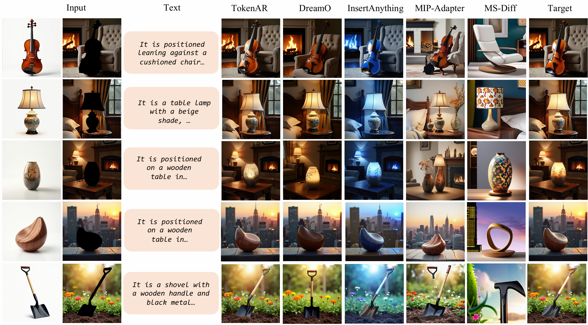
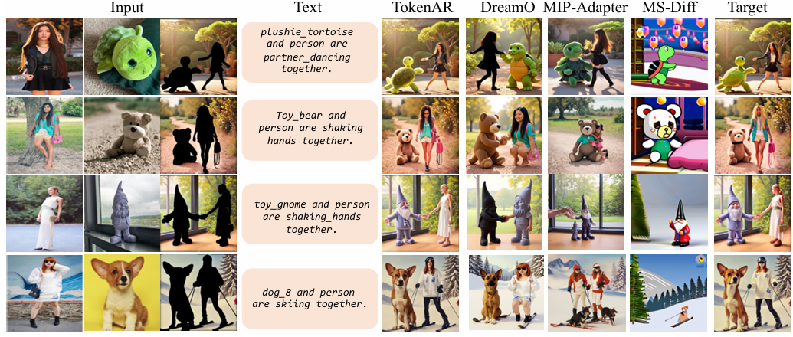
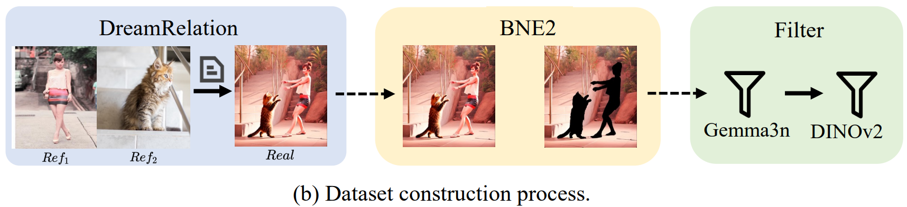
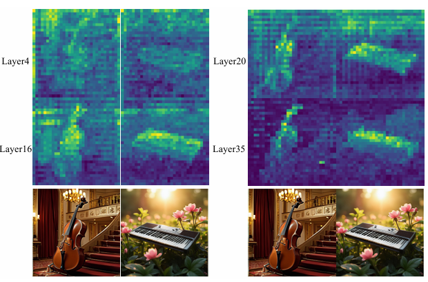

<div align="center">
<h1> TokenAR </h1>

<h3>TokenAR: Multiple Subject Generation via Autoregressive Token-level enhancement</h3>
<b>Haiyue Sun</b>, Qingdong He, Jinlong Peng, Peng Tang, Jiangning Zhang, <br>
 Junwei Zhu, Xiaobin Hu, Shuicheng YAN<br>
<br>
<a href="https://arxiv.org/abs/2510.16332"></a>
<a href="https://huggingface.co/lyrig2/TokenAR"></a>
<a href="https://huggingface.co/datasets/Xuan-World/SubjectSpatial200K"></a>

<!-- <h3>🎉 Accepted by ICCV 2025</h3> -->
</div>

## 🌠 Key Features



<br>
Fantastic results of our proposed TokenAR on multi-subject image generation consists of three core components: <br>

- (a) **Token Index Embedding**: Clusters token indices to better represent images of the same reference identity. 
- (b) **Instruct Token Injection**: Acts as an additional container for visual features, injecting detailed and complementary priors into the reference tokens. 
- (c) **Identity-Token Disentanglement (ITD)**: Explicitly guides the model to learn separate token representations for the features of each unique identity.

This approach enables strong identity consistency in the generated images while preserving high-quality background reconstruction.

## 🚩 **Updates**

<!-- - ✅ March 12, 2025. We release SubjectSpatial200K dataset. -->
- ✅ October 5, 2025. We release TokenAR framework.

### 🔧 Preparation
* Environment Setup. Please follow `install.sh` to install the packages as shown in `requirements.txt`. Then you may download all pre-trained checkpoints as instructed below.

* Download text encoder model [flan-t5-xl](https://huggingface.co/google/flan-t5-xl) and put it as `./pretrained_models/t5-ckpt/flan-t5-xl`. Download vqvae model [vq_ds16_t2i.pt](https://huggingface.co/peizesun/llamagen_t2i/resolve/main/vq_ds16_t2i.pt) from [LlamaGen](https://github.com/FoundationVision/LlamaGen) and put it as `./pretrained_models/vq_ds16_t2i.pt`.

* (Required for training) Download pre-trained text-to-image model [t2i_XL_stage2_512.pt](https://huggingface.co/peizesun/llamagen_t2i/resolve/main/t2i_XL_stage2_512.pt) from [LlamaGen](https://github.com/FoundationVision/LlamaGen) and put it as `./pretrained_models/t2i_XL_stage2_512.pt`.

<!-- * (Required for inference) Download our trained model [editar_release.pt](https://huggingface.co/datasets/JitengMu/CVPR2025_EditAR_release) and put it as `./checkpoints/editar/editar_release.pt`. -->

### 🚀 Demo
Please run the following script to generate single image. Put the source image and instruction text in the `./examples` as demonstrated, then run,
```
python3 autoregressive/sample/sample_edit_example_plus.py \
        --gpt-ckpt "${ckpt}" \
        --add_ref_embed \
        --multi-cond \
        --cfg-scale 3 \
        --seed 83 \
        --max_ref_num 4 \
        --additional-info "${CKPT_NAME}" \
        --device "${device}" \
        --concat-target \
        --dataset "./examples" \
        --instruct-token-mode casual \
        --instruct-token-num "${TOKENNUM}" \
```

### 🚀 Training
Data Preparation. For image editing, download [SpatialSubject200K](https://huggingface.co/datasets/Xuan-World/SubjectSpatial200K) and [InstructAR Dataset(Coming Soom)](). 

The folder should be preprocessed ending up looking like, 
```bash
./data/
    example1/
        ref/
            ref1.png
            ...
        background.png
        real.png
        description.txt
    example2/
    ...
```

We provide an example as shown in `train_concat_instruct.sh`. Please modify `train_concat_instruct.sh` accordingly to run on your system.

### 🚀 Dataset Constructing

To support robust training and evaluation for multi-reference image generation, we created the InstructAR Dataset. It is the first large-scale, open-source dataset specifically designed for this task. Its construction pipeline was built to address four key problems in existing datasets:

- Limited scale and relational diversity
- Insufficient pose variation
- Inaccurate segmentation masks
- Lack of quality control

Our dataset is built using a multi-stage pipeline to ensure scale, quality, and precision.

1. **Image Synthesis**: We use a relation-guided generative model ([DreamRelation](https://github.com/Shi-qingyu/DreamRelation)) to synthesize a large and diverse corpus of images. Each image is generated from two reference subjects and a text prompt describing their interaction. Subject Dataset can be found in [RelationBench](https://huggingface.co/datasets/QingyuShi/RelationBench) and [human_parsing_dataset](https://huggingface.co/datasets/mattmdjaga/human_parsing_dataset)
2. **Foreground & Background Extraction**: We use an automated tool (BNE2) to segment the foreground subjects from the background in the generated images. These masks are then manually refined to ensure high accuracy. Code are provided in `./scripts/background_segment.py`
3. **Rigorous Two-Stage Filtering**: To guarantee the quality and fidelity of our dataset, every sample undergoes a strict filtering process: **Semantic Filtering**: A Vision-Language Model ([gemma-3n-E4B-it](https://huggingface.co/google/gemma-3n-E4B-it)) validates that the generated image content accurately matches the text prompt. Samples that fail this check are discarded. **Identity Filtering**: We use DINOv2 feature similarity to confirm that the subjects in the generated image are visually consistent with the original reference images. This ensures high identity preservation. Codes are provided in `./scripts/gemma_filter.py` and `./scrips/dinov2_filter`

The folder ends up looking like, 
```bash
./data/
    example1/
        ref/
            ref1.png
            ...
        background.png
        real.png
        description.txt
    example2/
```
## Average Key Feature Analysis



To optimize the efficacy of the Instruct Token Injection mechanism, we performed an extensive ablation study on the number of instruct tokens used during training and inference.

This study confirms that a concise sequence length of **120 Instruct Tokens** strikes the best balance, delivering precise, targeted visual priors without introducing redundancy or instability. This ensures the instructional guidance remains potent and effective throughout the transformer blocks.

## Acknowledgement

The implementation is mainly built on top of [EditAR](https://github.com/JitengMu/EditAR/tree/main). We also want to thank the authors from [DreamRelation](https://github.com/Shi-qingyu/DreamRelation), [UniCombine](https://github.com/Xuan-World/UniCombine?tab=readme-ov-file), [Dino-v2](https://github.com/facebookresearch/dinov2) for the code release.

## License
The majority of this project is licensed under MIT License. Portions of the project are under separate license of referred projects.

## BibTeX
```bibtex
@article{mu2025editAR,
  title={TokenAR: Multiple Subject Generation via Autoregressive Token-level enhancement},
  author={Haiyue Sun, Qingdong He, Jinlong Peng, Peng Tang, Jiangning Zhang, Junwei Zhu, Xiaobin Hu, Shuicheng Yan},
  journal={arXiv preprint arXiv:2510.16332},
  year={2025}
}
```